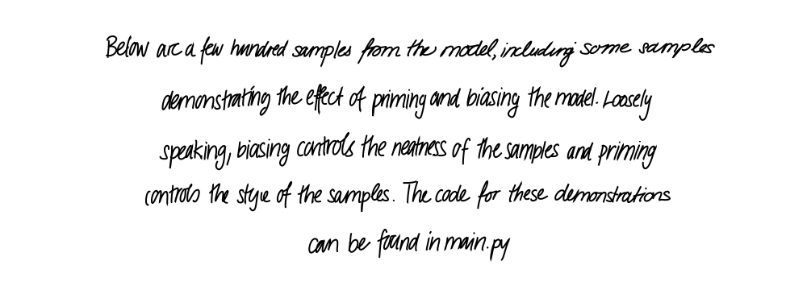
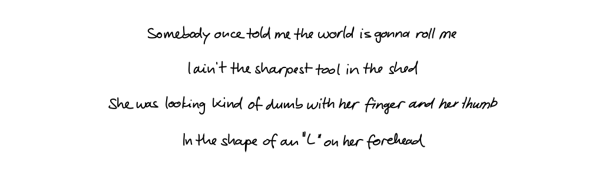
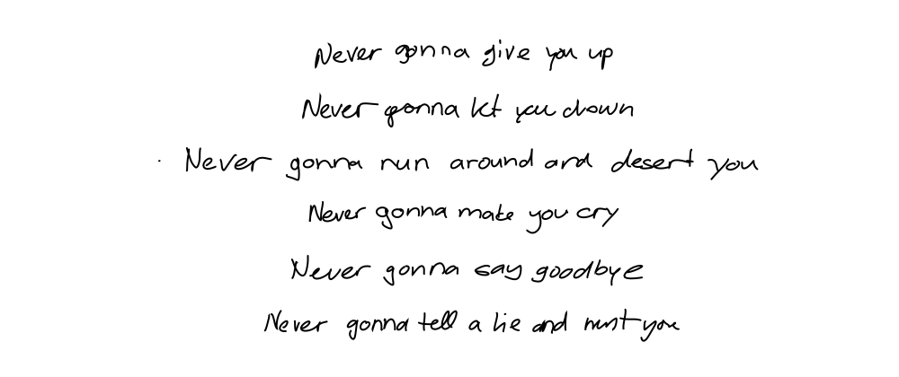

# Handwriting Synthesis (TFv2)

Original repo migrated to tensorflow v2 with better structure

#### Archived

---

Implementation of the handwriting synthesis experiments in the paper <a href="https://arxiv.org/abs/1308.0850">
Generating Sequences with Recurrent Neural Networks</a> by Alex Graves. The implementation closely follows the original
paper, with a few slight deviations, and the generated samples are of similar quality to those presented in the paper.

## Installation

```shell
git clone https://github.com/otuva/handwriting-synthesis
cd handwriting-synthesis
python -m venv venv
source venv/bin/activate
pip install -r requirements.txt
```

You can then run the demo as follows

```shell
python main.py
```

## Usage

```python
from handwriting_synthesis.hand import Hand

lines = [
    "Father time, I'm running late",
    "I'm winding down, I'm growing tired",
    "Seconds drift into the night",
    "The clock just ticks till my time expires",
]
biases = [.75 for _ in lines]
styles = [9 for _ in lines]
stroke_colors = ['red', 'green', 'black', 'blue']
stroke_widths = [1, 2, 1, 2]

hand = Hand()
hand.write(
    filename='img/usage_demo.svg',
    lines=lines,
    biases=biases,
    styles=styles,
    stroke_colors=stroke_colors,
    stroke_widths=stroke_widths
)
```



## Demonstrations

Below are a few hundred samples from the model, including some samples demonstrating the effect of priming and biasing
the model. Loosely speaking, biasing controls the neatness of the samples and priming controls the style of the samples.
The code for these demonstrations can be found in `main.py`.

### Demo #1:

The following samples were generated with a fixed style and fixed bias.

**Smash Mouth – All Star (<a href="https://www.azlyrics.com/lyrics/smashmouth/allstar.html">lyrics</a>)**


### Demo #2

The following samples were generated with varying style and fixed bias. Each verse is generated in a different style.

**Vanessa Carlton – A Thousand Miles (<a href="https://www.azlyrics.com/lyrics/vanessacarlton/athousandmiles.html">
lyrics</a>)**


### Demo #3

The following samples were generated with a fixed style and varying bias. Each verse has a lower bias than the previous,
with the last verse being unbiased.

**Leonard Cohen – Hallelujah (<a href="https://www.youtube.com/watch?v=dQw4w9WgXcQ">lyrics</a>)**


## Training

A pretrained model is included, but if you'd like to train your own,
read [these instructions](model/README.md)

## Contribute

All Pull Requests and packaging  are welcome

You can take a look at the [issues](https://github.com/otuva/handwriting-synthesis/issues)

If there aren't any, you can see [TODO.md](TODO.md)

If you are having a problem or have a feature request, feel free to open issue

---

This project was intended to serve as a reference implementation for a research paper, but since the results are of
decent quality, it may be worthwile to make the project more broadly usable. I plan to continue focusing on the machine
learning side of things. That said, I'd welcome contributors who can:

- Package this, and otherwise make it look more like a usable software project and less like research code.
- Add support for more sophisticated drawing, animations, or anything else in this direction. Currently, the project
  only creates some simple svg files.
